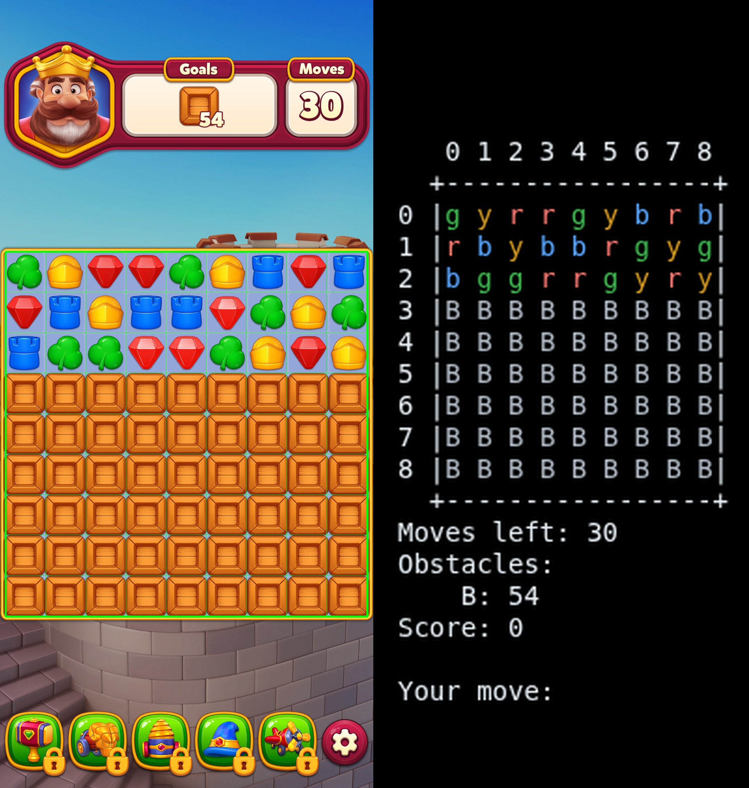

# 🍬 Match3Solver


### *Train an agent to crush candy from scratch — then hand it a real phone and let it play.*

A match-3 engine built from scratch, an RL agent trained to play it, and a
vision pipeline that lets the trained agent play a real mobile match-3 game.

**[🍭 Powerups & combos](#-powerups--combos) · [🧩 What's here](#-whats-here) · [🚀 Quick start](#-quick-start) · [📈 Status](#-status)**

<p align="center">

<br>
<sub>The vision pipeline's grid detection on a real run (left) — <code>engine/play.py</code> in the terminal (right)</sub>
</p>

The engine implements a generic match-3 ruleset. The vision pipeline reads
a live screenshot off an Android phone and maps it onto that same ruleset,
so a policy trained against the engine transfers to whatever match-3 game
the board-reading step is pointed at.

# 🍭 Powerups & combos

| Icon | Powerup | Made from |
|:---:|---|---|
| 🚀 | Rocket (vertical/horizontal) | 4-in-a-row |
| 💣 | TNT | A horizontal and vertical run crossing (T/L/+ shape) |
| ⚡ | Electro ball | 5-in-a-row |
| 🌀 | Spinner | 2×2 square of the same candy |

Any two powerups can be swapped together for a combo blast — see `_combo_*` in [`engine/board.py`](engine/board.py) for the full pairing matrix.

---

# 🧩 What's here

🎮 **[`engine/`](engine/)** — the game engine. A pure-Python board (`board.py`) with
match detection, cascades, four powerups and their pairwise combos, plus box/crate obstacles
that must be cleared to win. `game.py` wraps it into a playable session with
a move budget; `levels.py` holds hand-built layouts; `play.py` lets you play
it yourself in the terminal. No external game dependencies — this is a
from-scratch reimplementation.

🏋️ **[`rl/`](rl/)** — a [Gymnasium](https://gymnasium.farama.org/) environment
(`env.py`) around the engine: one-hot board observations, an action mask so
the policy only ever sees legal moves, and a reward built around the actual
objective (obstacles cleared, not candies popped). `policy.py` is a small
CNN policy/value network.

🧠 **[`rl/train.py`](rl/train.py)** — hand-rolled REINFORCE-with-baseline in PyTorch (no
stable-baselines3 or other RL library). Trains until you stop it, auto-
resumes from checkpoints, and logs a random-policy baseline so progress is
always measured against something.

📷 **[`vision/`](vision/)** — the real-world bridge. Takes a screenshot off an Android
phone, auto-detects the board's grid from its border, classifies each cell
(hue matching for candies, template matching for powerup sprites), and
feeds the parsed board to a trained checkpoint for a move suggestion.
`vision/play_live.py` drives the loop end to end: screenshot → suggest →
you play it on the phone → repeat. Grid detection and cell classification
are the only game-specific pieces — swap the templates/palette to point
the pipeline at a different match-3 game.

✅ **[`tests/`](tests/)** — pytest suite covering the engine, the RL environment, and
the vision pipeline (217 tests).

---

# 🚀 Quick start

```bash
python -m venv .venv && source .venv/bin/activate
pip install -r requirements.txt

# play the engine yourself in the terminal
python engine/play.py

# train an agent (Ctrl-C to stop; it checkpoints as it goes)
python rl/train.py --moves 15

# watch a trained checkpoint play
python scripts/watch.py models/reinforce_level1.pt

# suggest moves for a real game running on a connected Android phone
python vision/play_live.py
```

<details>
<summary><b>⚙️ Advanced flags</b></summary>

<br>

`rl/train.py`:

| Flag | Default | Meaning |
|---|---|---|
| `--level` | `1` | Level layout to train on |
| `--moves` | `30` | Max moves per episode |
| `--batch-episodes` | `16` | Episodes per policy update |
| `--lr` | `3e-4` | Learning rate |
| `--gamma` | `0.99` | Discount factor |
| `--entropy-coef` | `0.01` | Entropy bonus weight |
| `--powerup-coef` | `0.5` | Potential-based shaping weight for powerup creation |
| `--eval-episodes` | `50` | Episodes per evaluation pass |
| `--fresh` | off | Ignore existing checkpoints and start over |

`scripts/watch.py`:

| Flag | Default | Meaning |
|---|---|---|
| `--level` | latest trained | Level to play |
| `--delay` | `0.6` | Seconds between animated frames |
| `--step` | off | Step frame-by-frame on Enter (slo-mo) |

`vision/play_live.py`:

| Flag | Default | Meaning |
|---|---|---|
| `--serial` | none | `adb` device serial, for multiple connected phones |
| `--execute` | off | Actually swipe the move on the phone instead of just suggesting it |
| `--sim` | off | Run against a simulated board instead of a live screenshot |

</details>

---

# 📈 Status

Actively evolving — level layouts, obstacle types, and reward shaping are
all in flux as the agent's training catches up to the vision pipeline's
ability to read new levels off the real game.

<p align="center"><sub>🍬 built from scratch, trained from zero, playing for real 🍬</sub></p>
